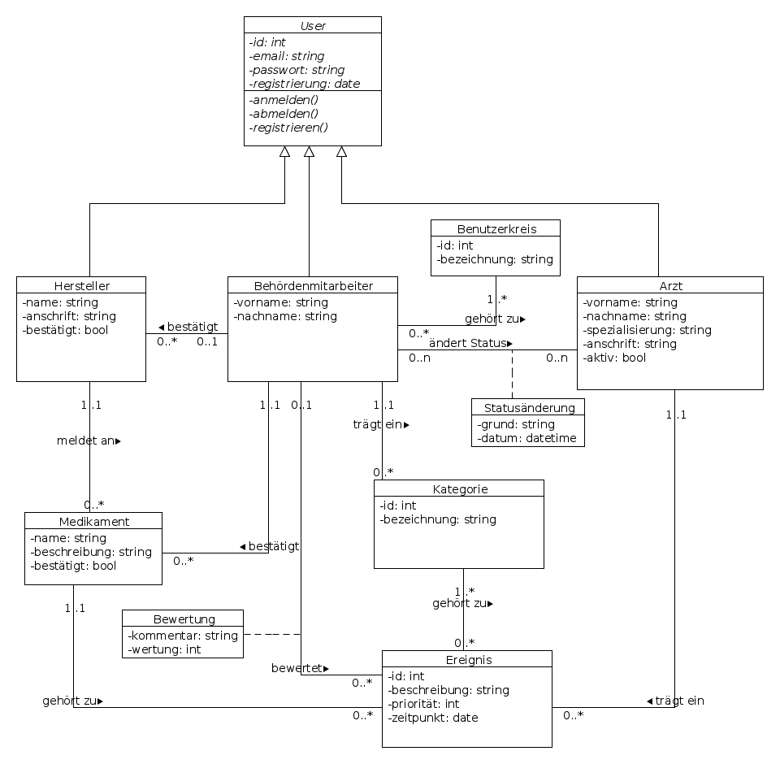
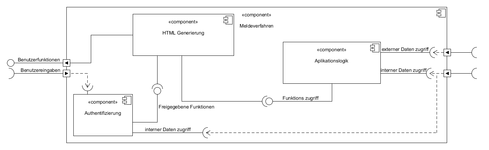

---
author:
	name1: Cristea, Liviu, 879401
	name2: Hensel, Simon, 880997
	name3: Wewering, Lukas, 880680
title:
	main: Systementwurf
	sub1: SWE-Praktikum 2 WS 2014/2015
revision:
	doc: swe_p2_systementwurf.0.md
	level: 0
	date: 23.11.2014
lang: de
---

# Systementwurf

## Datenbasis

## Beschreibung
Im Folgenden werden die einzelnen Klassen jeweils näher erläutert.

### User
Die Klasse *User* dient als abstrakte Basisklasse für die drei möglichen Rollen im Gesamtsystem. Zur Authentifizierung werden eine E-Mail und ein Passwort benötigt, zusätzlich wird das Registrierungsdatum vermerkt.

### Behördenmitarbeiter
Behördenmitarbeiter erben von *User* und speichern zusätzlich Vor- und Nachname.

Ein Mitarbeiter kann im System folgende Funktionen ausüben:

1. Bestätigung der von den Herstellern angemeldeten Medikamente
2. Bewertung der von den Ärzten eingetragenen Ereignisse und dahingehend Bewertung der Medikamente
3. (De)aktivierung der Ärzte-Accounts
4. Bestätigen der Hersteller
5. Datenpflege
6. Administrative Aufgaben

Je nach Befugnis werden einem Behördenmitarbeiter ein oder mehrere Benutzerkreis(e) zugewiesen, welche unterschiedliche Rechte verleihen (s. unten).

### Benutzerkreis
Einem Behördenmitarbeiter muss mindestens ein Benutzerkreis zugeordnet werden. Es existieren Benutzerkreise für die im Abschnitt *Behördenmitarbeiter* genannten Funktionen.
Die Benutzerkreise können beliebig kombiniert werden.

### Hersteller
Hersteller erben von *User* und implementieren zusätzlich Namen und Anschrift.

Ein Hersteller kann beliebig viele Medikamente anmelden. Um mit dem System interagieren zu können, muss der *Hersteller*-Account von einem *Behördenmitarbeiter* aktiviert worden sein.

### Arzt
Ärzte erben von *User* und implementieren zusätzlich Vorname, Nachname, Spezialisierung und Anschrift.

Ein Arzt ist dafür zuständig, Ereignisse zu Medikamenten einzutragen. Sein Status kann von Behördenmitarbeitern mit entsprechenden Rechten unter Angabe eines Grundes aktiviert oder deaktiviert werden.

### Medikament
Ein Medikament wird von *einem* Hersteller eingetragen und kann anschließend von einem Behördenmitarbeiter bestätigt werden.
Weiterhin kann ein Medikament beliebig vielen *Ereignissen* zugeordnet werden.

### Ereignis
Ein Ereignis wird von einem *Arzt* eingetragen. Neben einer Beschreibung wird mit der Priorität eine Einordnung bezüglich der Relevanz vorgenommen. Es gilt: Je größer der Wert, desto negativer ist das Ereignis.
Jedem Ereignis wird genau ein *Medikament* und mindestens eine *Kategorie* zugeordnet.

Eingetragene Ereignisse können von einem Behördenmitarbeiter bewertet werden.

### Bewertung
Pro Medikament kann von einem *Behördenmitarbeiter* eine Bewertung eingetragen werden. Diese wird anhand der vorliegenden *Ereignisse* festgelegt.
Die *Bewertung* besteht aus einem Kommentar und einer Wertung.

### Kategorie
Eine *Kategorie* spezifiziert ein *Ereignis* und wird von einem *Behördenmitarbeiter* eingetragen.

### Statusänderung
Eine *Statusänderung* kann von einem *Behördenmitarbeiter* hinzugefügt werden und bezieht sich immer auf einen Arzt. Es bewirkt die Änderung des aktiv-Flags. 
Für die Statusänderung muss ein Grund angegeben werden.

## Umwandlung in relationales Datenmodell

### User

|Attribut	|Typ	|
|-----------|-------|
|id			|int	|
|rolle_id	|int	|
|email		|string	|
|passwort	|string	|
|registrierung|datetime|

### Benutzerkreis

|Attribut	|Typ	|
|-----------|-------|
|id			|int	|
|bezeichnung|string	|

### User_Benutzerkreis

|Attribut	|Typ	|
|-----------|-------|
|user_id	|int	|
|benutzerkreis_id|int|

### Hersteller

|Attribut	|Typ	|
|-----------|-------|
|id			|int	|
|name		|string	|
|anschrift	|string	|
|bestätigt	|bool	|

### Arzt

|Attribut	|Typ	|
|-----------|-------|
|id			|int	|
|vorname	|string	|
|nachname	|string	|
|spezialisierung|string|
|anschrift	|string	|
|aktiv		|bool	|

### Medikament

|Attribut	|Typ	|
|-----------|-------|
|id			|int	|
|hersteller_id|int	|
|name		|string	|
|beschreibung|string|
|bestätigt	|bool	|

### Ereignis

|Attribut	|Typ	|
|-----------|-------|
|id			|int	|
|medikament_id|int	|
|arzt_id	|int	|
|beschreibung|string|
|priorität	|int	|
|zeitpunkt	|date	|

### Bewertung

|Attribut	|Typ	|
|-----------|-------|
|ereignis_id|int	|
|mitarbeiter_id|int	|
|kommentar	|string	|
|wertung	|int	|

### Kategorie

|Attribut	|Typ	|
|-----------|-------|
|id			|int	|
|bezeichnung|string	|
|mitarbeiter_id|int |

### Ereignis_Kategorie

|Attribut	|Typ	|
|-----------|-------|
|ereignis_id|int	|
|kategorie_id|int	|

### Statusänderung
|Attribut	|Typ	|
|-----------|-------|
|id			|int	|
|mitarbeiter_id|int  |
|arzt_id	|int	|
|grund		|string	|
|datum		|datetime|

## Komponenten

### Beschreibung

*	(externes) Melderegister:
	Stellt die zum Abgleichen benötigten externen Daten zur Verfügung.

*	Hardwerzugriffsschicht:
	Gewährleistet den Hardwarezugriff auf die Daten.

*	DBMS:
	Verwaltet die Datenbank per PostgresSQL. Es sind Standart Zugriffe möglich, wie lesen, schreiben und löschen.

*	Webserver:
	Stellt die Webaplikation Meldeverfahren zur Verfügung und leiten die externen/internen Datenzugriffe an sie weiter.

*	Meldeverfahren:
	Die Webaplikation, welche dem Benutzer die gewünschten Funktionen zur Verfügung stellt und seine Eingaben verarbeitet.

*	Webbrowser:
	Beliebiger Webbrowser, der die Benutzereingaben an den Webserver schickt und die gewünschten Funktionen für den Benutzer zur Darstellung bringt. 

### Komponenten des Meldeverfahrens

*	Benutzerschnittstelle:
	Liefert die Benutzerfunktionen durch der von der Authentifizierung geliferten für den aktuellen Benutzer freigegebenen Funktionen und greift durch die Aplikationslogik auf diese zu.

*	Aplikationslogik:
	Liefert Funktions zugriff auf die von der benutzerschnittstelle benötigten Funktionen.

*	Authentifizierung:
	Authentifiziert den benutzer und gibt der Benutzerschnittstelle an welche Funktionen dieser zur Verfügung hat.

### Komponenten der Benutzerschnittstelle

*	Funktionen vorbereiten:
	Zieht die nicht für den gerade eingelogten Nutzer bestimmten Funktionen von den zur Verfügung stehenden Funktionen ab und gibt diese zur Visualisierung an Benutzerfunktionen weiter.

*	Benutzerfunktion:
	Nimmt die für den Benutzer freigegebenen Funktionen und visualisiert sie mithilfe des gerade benötigten Formulars.
	Unter anderem sehen die Formulare folgendermaßen aus:
	* Registrierungsformular für Ärzte:
	
	* Meldeformular:
	
	* Registrierungsformular für Medikamente:
	

### Komponenten der Authentifizierung

*	Registrieren/Einlogen:
	Stellt dem Benutzer eine Registrierung zur Verfügung, oder liefert den Login falls vorhanden.

*	Registrierung/Login prüfen:
	Abgleichung und Eintragung der Registrierung, oder falls Login schon vorhanden Abgleichung mit der Datenbank.

*	Funktionen freigeben:
	Wenn der Login oder die Registrierung bestätigt ist, wird geliefert welche Funktionen diesem Benutzer zur Verfügung stehen sollten.

### Komponenten der Aplikationslogik

*	externer Daten zugriff:
	Aufbereitung und Filterung der externen Daten.

*	interne Daten verwalten:
	Liefert Datenbank zugriff (löschen, ändern , erstellen) und filter sie und bereitet sie für die Verwendung auf. 

*	Funktionen Medikamente:
	Stellt die Funktionen für alles was Medikamente betrifft zur Verfügung. Dies Beinhaltet:
	*	Medikamente registrieren 
	*	Medikamente bestätigen
	*	Medikamente bewerten
	*	Ereignisse zu Medikamenten melden 

*	Funktionen Datenpflege:
	Beinhalten die Funktionen zur Datenpflege.

*	Funktionen DV:
	Beinhalten die administrativen Funktionen.

* 	Funktionen:
	Fasst sämtliche Funktionen zusammen und stellt diese zur Verfügung.

